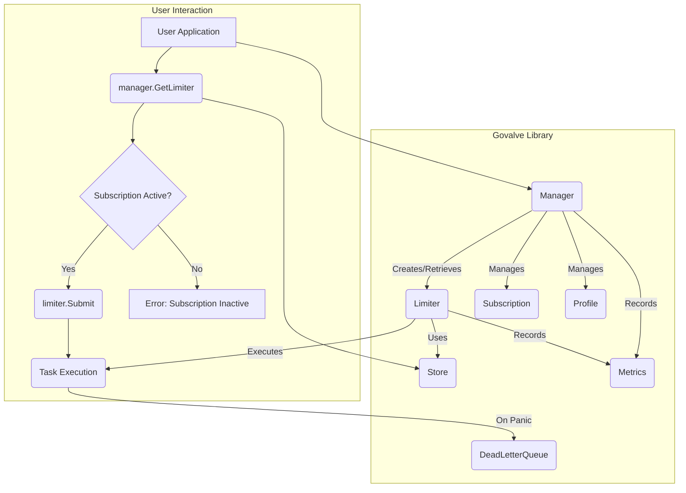

# Govalve Architecture: Rate Limiting and Subscription Management Approaches

This document explains the architectural approaches used in the Govalve library for implementing rate limiting and subscription management.

## Overview

Govalve provides a comprehensive solution for managing concurrency, rate limiting, and subscriptions in multi-tenant systems. The library takes a tiered approach that allows for both shared and dedicated resource allocation models, with robust subscription management and usage quota enforcement.

## Architecture Visualization

The following flowchart illustrates the interaction between the main components of the `govalve` library:



## Rate Limiting Approach

### Core Components

1. **Manager**: The central orchestrator that manages profiles, subscriptions, and limiters
2. **Profiles**: Configuration templates that define resource allocation policies
3. **Limiters**: User-specific rate limiting instances that enforce quotas
4. **Store**: Persistent storage interface for subscription data

### Implementation Details

#### Flexible Resource Allocation

Govalve implements a flexible two-tier resource allocation model:

1. **Shared Resources**: Multiple users share a common resource pool with a defined rate limit
   ```go
   // Example: 1000 users share 100 requests per minute
   manager.RegisterProfile("free-tier", 
       govalve.WithSharedResource("external-api", rate.Limit(100/60)))
   ```

2. **Dedicated Resources**: Each user gets their own isolated resource allocation
   ```go
   // Example: Each user gets dedicated 500 requests per minute
   manager.RegisterProfile("pro-tier",
       govalve.WithDedicatedResource(rate.Limit(500/60)))
   ```

#### Worker Pool Management

Each profile can be configured with a worker pool that handles task execution:
- Configurable concurrency limits
- Queue management for backpressure handling
- Graceful shutdown support with in-flight task completion

#### Rate Limiting Implementation

Govalve leverages the `golang.org/x/time/rate` package for rate limiting, which implements the token bucket algorithm:

The token bucket algorithm is a rate limiting technique that works as follows:
1. Tokens are added to a bucket at a fixed rate (up to a maximum capacity)
2. Each request consumes one or more tokens from the bucket
3. If there are not enough tokens, the request is either delayed or rejected
4. If the bucket is empty, requests are rate-limited until tokens are added

This approach provides several benefits:
- Allows for bursts of traffic up to the bucket capacity
- Provides smooth request processing rather than harsh cutoffs
- Distributes requests evenly over time
- Offers predictable performance characteristics

In Govalve's implementation:
- Each limiter maintains its own token bucket
- Tokens are replenished at the configured rate limit
- Context-aware operations with timeout and cancellation support
- Thread-safe concurrent access for multi-tenant environments

### Task Execution Model

Govalve uses a worker pool model for task execution:
- Tasks are submitted to a queue with configurable size
- Worker goroutines pull tasks from the queue and execute them
- Rate limiting is applied before task execution using the token bucket algorithm
- Panic recovery ensures failed tasks don't crash workers
- Dead letter queue support for failed tasks

## Subscription Management Approach

### Core Concepts

1. **Subscription Lifecycle**: Automatic validation of active/expired status
2. **Usage Quotas**: Enforced limits on resource consumption
3. **Persistent State**: Pluggable storage backend for subscription data

### Implementation Details

#### Subscription Structure

The `Subscription` struct contains key information:
- UserID for identification
- ProfileName linking to resource configuration
- Status tracking (Active, Expired, Canceled)
- Time-based validity (StartDate, EndDate)
- Usage tracking for quota enforcement
- Per-user quota override capability

#### Store Interface

Govalve uses a pluggable storage approach through the `Store` interface:
```go
type Store interface {
    GetSubscription(ctx context.Context, userID string) (*Subscription, error)
    SaveSubscription(ctx context.Context, sub *Subscription) error
    CheckAndIncrementUsage(ctx context.Context, userID string, quota int64) error
}
```

This allows integration with various storage backends:
- In-memory (for testing)
- Redis
- PostgreSQL
- MongoDB
- Other databases

The library provides a production-ready `InMemoryStore` that can be used for testing and demonstration purposes.

The `CheckAndIncrementUsage` method is designed to be atomic, ensuring thread-safe quota management.

#### Subscription Validation Flow

1. When a user requests a resource:
   - Manager retrieves subscription from Store
   - Validates subscription status (active/not expired)
   - Checks usage quota if applicable
   - Returns appropriate limiter or error

2. During resource usage:
   - Limiter tracks usage through Store interface
   - Atomic operations ensure quota consistency
   - Exceeded quotas immediately block further requests

#### Subscription Management Features

Govalve provides several APIs for subscription management:
- `Subscribe`: Create a new subscription for a user
- `GetSubscription`: Retrieve a user's subscription details
- `ExtendSubscription`: Extend a subscription's duration
- `CancelSubscription`: Cancel a subscription
- `ResetUsage`: Reset a user's usage counter
- `UpdateSubscriptionQuota`: Change a user's individual quota

### Key Features

1. **Real-time Validation**: Instant blocking of expired or over-quota users
2. **Atomic Operations**: Thread-safe usage tracking
3. **Graceful Degradation**: System continues operating even when some subscriptions expire
4. **Zero-Downtime Scaling**: Add/remove capacity without service interruption
5. **Flexible Quotas**: Both profile-level and per-user quota overrides
6. **Subscription Lifecycle Management**: Create, extend, cancel subscriptions

## Error Handling and Recovery

### Retry Mechanisms

Govalve implements configurable retry logic for operations that might fail temporarily:
- Exponential backoff strategy
- Configurable maximum attempts, base delay, and maximum delay
- Context-aware cancellation during retries
- Distinction between retryable and non-retryable errors

The retry mechanism uses an exponential backoff algorithm:
1. Operations are attempted up to a configurable maximum number of times
2. Between attempts, delays are calculated using the formula: `delay = baseDelay * (multiplier^(attempt-1))`
3. Delays are capped at a configurable maximum to prevent excessive waiting
4. Context cancellation is respected during delays

This approach helps handle transient failures like network issues or temporary database unavailability.

The retry mechanism is currently used for store operations in the Manager, such as saving subscriptions. It is implemented through the `WithRetry` function which takes a context, retry configuration, and operation function.

### Dead Letter Queue

Failed tasks can be automatically routed to a dead letter queue for later inspection or reprocessing:
- `DeadLetterQueue` interface for pluggable implementations
- In-memory implementation provided for testing
- Failed tasks include error information and metadata
- APIs for retrieving and removing failed tasks

The dead letter queue algorithm works as follows:
1. When a task panics during execution, it's caught by the worker's recovery mechanism
2. A `FailedTask` struct is created containing the original task, user information, error details, timestamp, and attempt count. Each failed task is assigned a unique ID using UUID.
3. The failed task is added to the configured dead letter queue via the `Add` method
4. Applications can later retrieve failed tasks using the `GetFailed` method for inspection or reprocessing
5. Successfully reprocessed tasks can be removed using the `Remove` method

This approach ensures that transient failures don't result in lost work, while providing a mechanism for operators to inspect and handle persistent failures.

It's important to note that the dead letter queue and retry mechanisms are separate features:
- The retry mechanism attempts to retry operations that failed temporarily
- The dead letter queue captures tasks that failed permanently (e.g., due to panics) for later inspection

The dead letter queue is specifically designed to handle unrecoverable errors like panics in task execution, while the retry mechanism handles transient failures in operations like database calls.

## Metrics and Observability

Govalve includes built-in metrics collection through a pluggable `Metrics` interface:
- Task submission metrics (success/failure rates, durations)
- Subscription lifecycle events
- Usage quota tracking and utilization metrics
- Standard metrics types: counters, histograms, and gauges

The metrics interface can be integrated with popular monitoring systems like Prometheus, DataDog, etc.

## Integration Patterns

### SaaS API Gateway
```go
// Free tier: Shared resources for cost efficiency
manager.RegisterProfile("free", 
    govalve.WithSharedResource("api-pool", rate.Limit(100/60)),
    govalve.WithWorkerPool(50, 1000))

// Pro tier: Dedicated resources for performance
manager.RegisterProfile("pro",
    govalve.WithDedicatedResource(rate.Limit(500/60)),
    govalve.WithUsageQuota(10000))
```

### Database Connection Management
```go
// Basic users share a connection pool
manager.RegisterProfile("basic-db",
    govalve.WithSharedResource("db-pool", rate.Limit(50)),
    govalve.WithWorkerPool(10, 100))

// Enterprise users get dedicated connections
manager.RegisterProfile("enterprise-db",
    govalve.WithDedicatedResource(rate.Limit(200)),
    govalve.WithWorkerPool(50, 500))
```

## Design Benefits

1. **Architectural Flexibility**: Mix shared and dedicated models in the same application
2. **Business Model Support**: Easy tier upgrades/downgrades
3. **Production Ready**: Built for high-concurrency environments
4. **Observability**: Metrics collection through pluggable interface
5. **Scalability**: Horizontal scaling with isolated failures
6. **Compliance Ready**: Audit trails through persistent subscription tracking
7. **Extensibility**: Pluggable interfaces for storage, metrics, and error handling
8. **Robust Error Handling**: Retry mechanisms and dead letter queues
9. **Comprehensive Subscription Management**: Full lifecycle management capabilities

## Conclusion

Govalve's approach to rate limiting and subscription management provides a robust, flexible foundation for resource allocation in multi-tenant systems. By combining the token bucket algorithm with a tiered subscription model and pluggable storage, it offers both performance and business flexibility that can adapt to various deployment scenarios. The addition of metrics, error handling, and recovery mechanisms makes it suitable for production environments.
